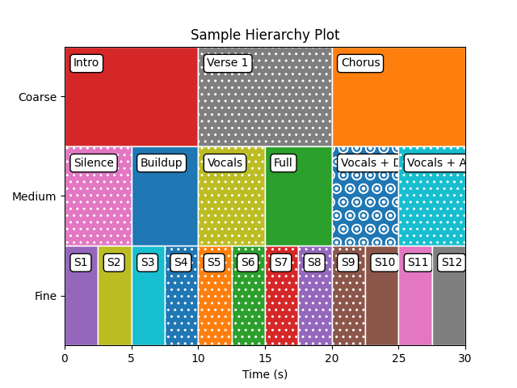

# BNL: Boundaries and Labels

A Python library for hierarchical text segmentation and evaluation.

## Quick Start

```python
import numpy as np
from bnl import Segment, plot_segment

# Create a segment
boundaries = {0.0, 2.5, 5.0, 7.5, 10.0}  # Set of boundary times
labels = ['A', 'B', 'A', 'C']
seg = Segment(boundaries, labels)

# Visualize
fig, ax = plot_segment(seg, text=True)
```

## Installation

```bash
git clone https://github.com/tomxi/bnl.git
cd bnl
pip install -e ".[dev,docs]"
```

## Development

- **Serve Docs**: `Cmd+Shift+P` → `Tasks: Run Task` → `Serve Docs`
- **Format**: Auto-formatting enabled on save

## Features

- **Core**: Hierarchical text segmentation with `Segment` class
- **Visualization**: Rich plotting with customizable styling
- **Hierarchical Plotting**: The `Hierarchy` class now supports a `plot()` method to visualize multiple layers of segmentation. Each layer is displayed in its own vertical region, with layer names as y-axis ticks:
  
- **Integration**: Compatible with mir_eval and MIR tools

## License

MIT